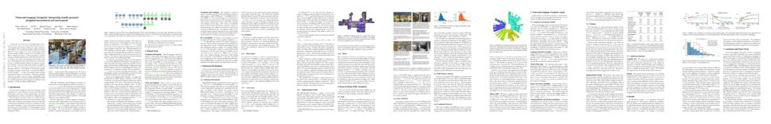

## Matterport3D Simulator

The Matterport3D Simulator supports development of AI agents that interact with real 3D environments using visual information (RGB-D images). It is primarily intended for research in deep reinforcement learning, at the intersection of computer vision, natural language processing and robotics.

## Room-to-Room (R2R) Navigation Dataset


## Download

The Matterport3D Simulator and the Room-to-Room dataset are available on [GitHub](https://github.com/peteanderson80/Matterport3DSimulator).

## Paper

If you use the simulator or dataset, please cite our [paper](https://arxiv.org/pdf/1711.07280){:target="_blank"}:

[](https://arxiv.org/pdf/1711.07280){:target="_blank"}

```
@article{mattersim,
  title={Vision-and-Language Navigation: Interpreting visually-grounded navigation instructions in real environments},
  author={Peter Anderson and Qi Wu and Damien Teney and Jake Bruce and Mark Johnson and Niko Sünderhauf and Ian Reid and Stephen Gould and Anton van den Hengel},
  journal={arXiv preprint arXiv:1711.07280},
  year={2017}
}
```

## Team


## Future Work

To drive research in new and more challenging directions, we plan to release several related datasets at the intersection of computer vision, natural language processing and robotics.



## Acknowledgements

We would like to thank [Matterport](https://matterport.com/) for allowing the Matterport3D dataset to be used by the academic community. This project is supported by a [Facebook ParlAI Research Award](https://research.fb.com/announcing-the-winners-of-the-facebook-parlai-research-awards/), and by the [Australian Centre for Robotic Vision](https://www.roboticvision.org/).



