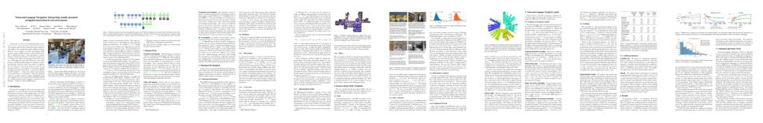

## Room-to-Room (R2R) Navigation



R2R is the first benchmark dataset for visually-grounded natural language navigation in real buildings. The dataset requires autonomous agents to follow human-generated navigation instructions in previously unseen buildings, as illustrated in the demo above. For training, each instruction is associated with a Matterport3D Simulator trajectory. 22k instructions are available, with an average length of 29 words. We are currently setting up a test evaluation server for this dataset.

## Matterport3D Simulator

The Matterport3D Simulator enables the development of AI agents that interact with real 3D environments using visual information (RGB-D images). It is primarily intended for research in deep reinforcement learning, at the intersection of computer vision, natural language processing and robotics. Visual imagery for the simulator comes from the [Matterport3D dataset](https://niessner.github.io/Matterport/), containing comprehensive panoramic imagery and other data from 90 large-scale buildings.

## Download

The Matterport3D Simulator and the Room-to-Room dataset are available on [GitHub](https://github.com/peteanderson80/Matterport3DSimulator).

## Paper

If you use the simulator or dataset, please cite our [paper](https://arxiv.org/pdf/1711.07280){:target="_blank"}:

[](https://arxiv.org/pdf/1711.07280){:target="_blank"}

```
@article{mattersim,
  title={Vision-and-Language Navigation: Interpreting visually-grounded navigation instructions in real environments},
  author={Peter Anderson and Qi Wu and Damien Teney and Jake Bruce and Mark Johnson and Niko S{\"u}nderhauf and Ian Reid and Stephen Gould and Anton van den Hengel},
  journal={arXiv preprint arXiv:1711.07280},
  year={2017}
}
```
This work was presented at the [NIPS 2017 Visually-Grounded Interaction and Language (ViGIL) workshop](https://nips2017vigil.github.io/). 

## People



## Future Work

To drive research in new and more challenging directions, we plan to release several related datasets at the intersection of computer vision, natural language processing and robotics.



## Acknowledgements

We would like to thank [Matterport](https://matterport.com/) for allowing the Matterport3D dataset to be used by the academic community. This project is supported by a [Facebook ParlAI Research Award](https://research.fb.com/announcing-the-winners-of-the-facebook-parlai-research-awards/), and by the [Australian Centre for Robotic Vision](https://www.roboticvision.org/).



